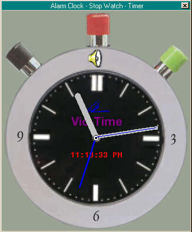

## Graphical AlarmClock/StopWatch/Timer

### Description

This is a graphically interactive analog (with digital readout) Stop Watch that shows the correct time, allows you to set an alarm time/sound (6 choices) and to record elapsed time. It was fun building it. I grabbed imagery and sounds from around the web. There are some minor bugs and the commenting is not completed. It could have been better planned which means that the code isn't as elegant as it should be. Hope some of you find it useful for learning or whatever. Cheers!
 
### More Info
 

             |
---                |---
**Submitted On**   |2002-11-25 22:25:52
**By**             |[A\. G\. Violette](https://github.com/Planet-Source-Code/PSCIndex/blob/master/ByAuthor/a-g-violette.md)
**Level**          |Advanced
**User Rating**    |5.0 (10 globes from 2 users)
**Compatibility**  |VB 6\.0
**Category**       |[Graphics](https://github.com/Planet-Source-Code/PSCIndex/blob/master/ByCategory/graphics__1-46.md)
**World**          |[Visual Basic](https://github.com/Planet-Source-Code/PSCIndex/blob/master/ByWorld/visual-basic.md)
**Archive File**   |[Graphical\_15036611262002\.zip](https://github.com/Planet-Source-Code/a-g-violette-graphical-alarmclock-stopwatch-timer__1-41056/archive/master.zip)

